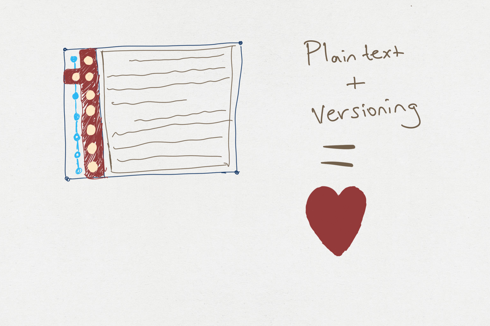

# menote
Plain text + Versioning = ❤

# How to run (for development)

## Option 1

1. Open Visual Studio Code
2. Open the root folder
3. Press CTRL + SHIFT + B

## Option 2

Dobule click on the `win-run.bat` and it should run the app
